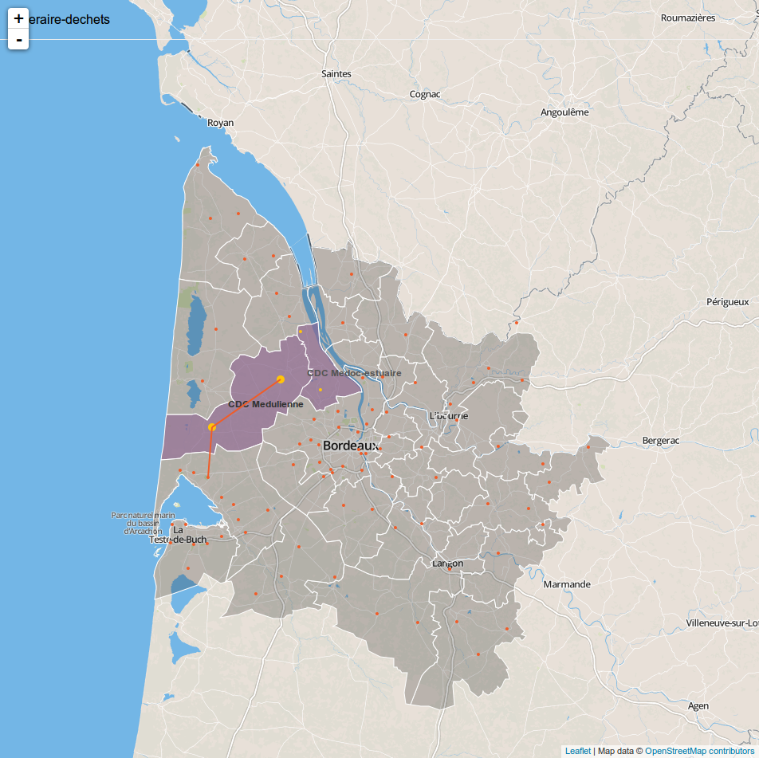

# ECV-IJBA
 
is dataviz project with students from the ECV and IJBA shcools.

# Getting started 

    Install: npm install -g generator-leaflet
    Create Folder: mkdir my-map-app && cd my-map-app
    Scaffold App: yo leaflet
    Run gulp for building and gulp watch for preview

```bash
sudo npm install -g generator-leaflet
mkdir myApp && cd myApp && yo leaflet
npm install --save-dev topojson generator-leaflet underscore gulp
bower install --save topojson font-awesome d3-plugins
```

