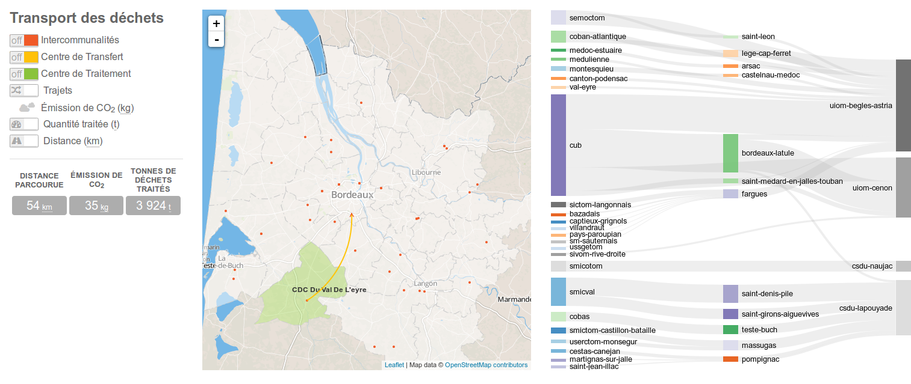

# ECV-IJBA

ECV-IJBA is dataviz project to visualize trash mobility in Gironde area, with students from:

* [ÉCV](http://ecv.fr/), _School for Visual Communication_ and,
* [IJBA](http://www.ijba.u-bordeaux3.fr/), _Institute for Journalism in Bordeaux Aquitania_.



[TOC]

# Install

Start by cloning the project repository:
```bash
git clone https://github.com/edouard-lopez/ECV-IJBA.git ecv-ijba
cd ecv-ijba
```
And install some tooling:
```bash
npm install -g yo bower grunt-cli gulp topojson
```

# Getting started

Install project dependecy using `npm` and `bower`:
```bash
npm install
bower install
```
Run a preview with `gulp`:
```bash
gulp serve
```
Start playing !

## Want to scaffold a similar project ?

This project use [Leaflet javascript library](http://leafletjs.com/) to support the interaction with the map.

So start by installing [Leaflet generator](https://www.npmjs.org/package/generator-leaflet) for `yeoman`:
```bash
sudo npm install -g generator-leaflet gulp
```

Continue by scaffolding the application with the `yeoman`'s generator:
```bash
mkdir my-map-app && cd my-map-app
yo leaflet
```
Then install others dependencies:
```bash
npm install --save-dev topojson generator-leaflet underscore gulp gulp-sass
bower install --save topojson font-awesome d3-plugins
```
Finish by running `gulp` for building and gulp watch for preview :
```bash
gulp watch
```

### License

Project under [GPLv3 license](http://choosealicense.com/licenses/gpl-3.0/).